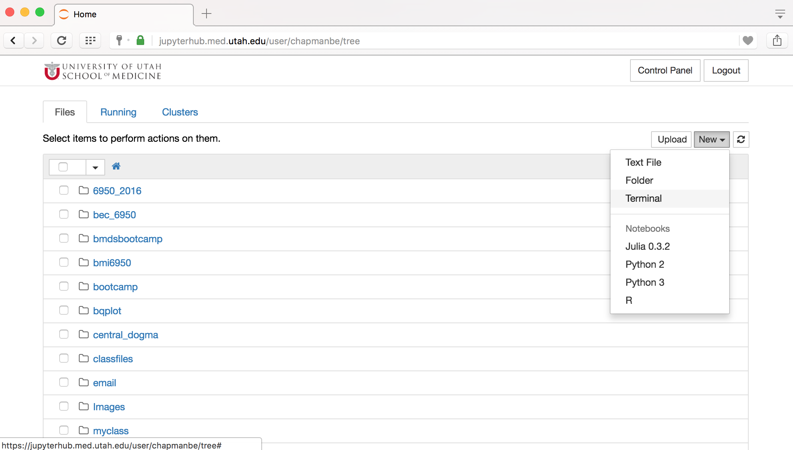

# nlm_clinical_nlp

Welcome to the GitHub repository for the clinical NLP course for the NLM Georgia Biomedical Informatics Course.

The notebooks assume that you are using the Jupyterhub environment at the University of Utah.

If you have been added to the environment, do the following steps:

* With your favorite web browser, go to [jupyterhub.med.utah.edu](https://jupyterhub.med.utah.edu)

* Authenticate with GitHub

* Open a new terminal

* Clone the repository with the command ``git clone https://github.com/chapmanbe/nlm_clinical_nlp.git``

* If you have already cloned the repository and want to get the updated code, cd to the directory with the command ``cd nlm_clinical_nlp`` and execute the command ``git pull``

* Now back in your home page, click on the ``nlm_clinical_nlp`` folder and open the ``ROADMAP.ipynb`` file.
